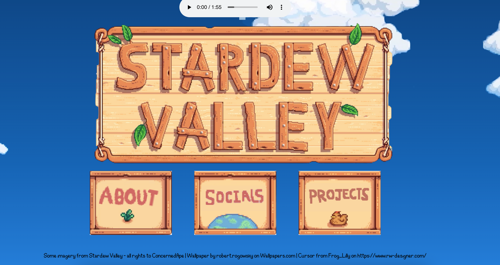

# This project is my Stardew Valley Portfolio! 

### What my project is/does:
> It looks like the Stardew Valley home page! You can play the music and view the scrolling-up animation.
>
> I added pages for "About, "Contact", and "Projects"!
> 
> Here's a screenshot!
> > 

### How you can view my project:
> Click here: https://zarazahed.github.io/gamefolio/

### Why I made my project:
> I loved the idea of a themed portfolio!
> Stardew Valley is one of my all-time favourite games.

### How I made my project:
> I used HTML, CSS, and JavaScript to make the site!

### What I struggled with and what I learned:
> I struggled with making the buttons.
> And I had issues with trying to make the music play.
> The process helped me learn though! :)

#### Credits
> Images and music from Stardew Valley used.
